<h1 align="center">

  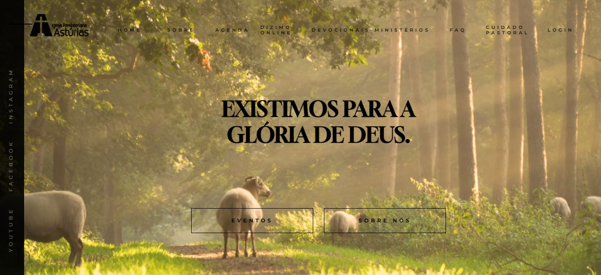

</h1>

# Igreja Presbiteriana Astúrias

<h4 align="center"> 
  Site institucional feito para a igreja. <br />
	🚧  Status - Revisão 🚀 🚧
  <br />
  
  [//]: <> (<a href="https://dianitacosturacriativa.com.br/" target="_blank">🔗 Acesse o site aqui!
  </a>)
  
  
</h4>


---
## Índice
<br />

- <a href="#-sobre-o-projeto">Sobre</a>
- <a href="#-funcionalidades">Funcionalidades</a> 
- <a href="#-layout">Layout</a>
- <a href="#-como-executar-o-projeto">Como executar o projeto localmente</a>
- <a href="#-tecnologias">Tecnologias</a> 
- <a href="#-autor">Autor</a>
---

## 💻 Sobre o projeto

Projeto desenvolvido com o intuito de expandir os canais de comunicação, posicionar a igreja nos mecanismos de busca e mostrar o que a igreja pode oferecer para os membros e para a comunidade local! ❤️❤️❤️

---

## ⚙️ Funcionalidades

- [x] Sobre
- - [x] Download das confissões de fé
- [x] Agenda
- - [x] Paginação
- [x] Dizimo Online
- [x] Devocionais
- - [x] Paginação
- - [x] Visualizar Devocional
- [x] Ministérios
- [x] Faq
- [x] Cuidado Pastoral
- - [x] Oração
- - [x] Aconselhamento
- - [x] Contato
- - [x] Saber mais sobre Jesus
- [x] Login

- Próximas Funcionalidades
- [] Acesso ao painel administrativo
- [] Consumo de dados (Devocionais, Agenda) via API
---

## 🎨 Layout 

Como ficou o layout da aplicação:

---

## 📱 Mobile

<p align="center">

  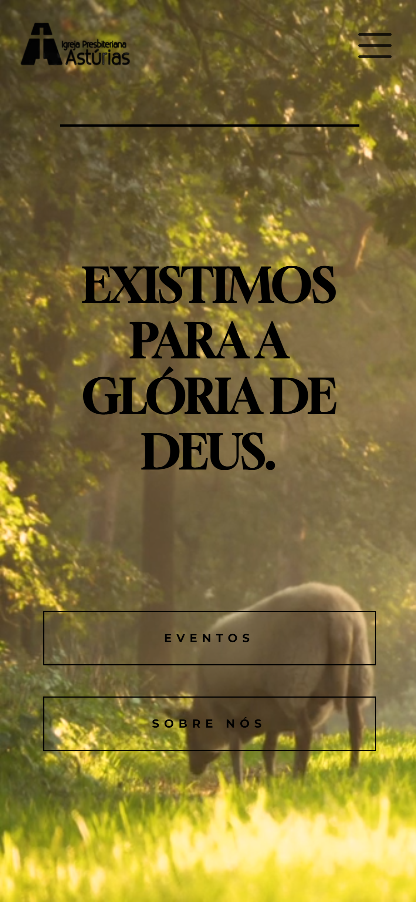

  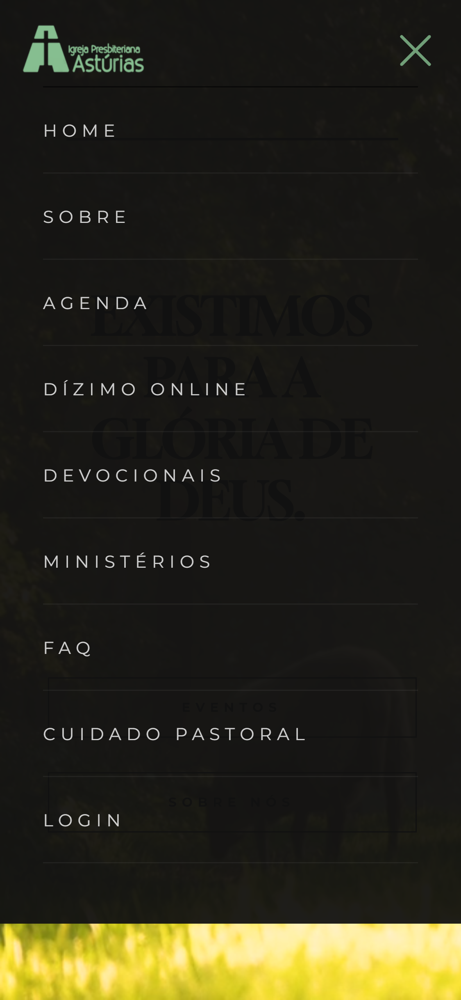

  

  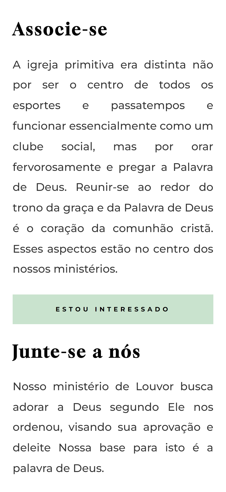

  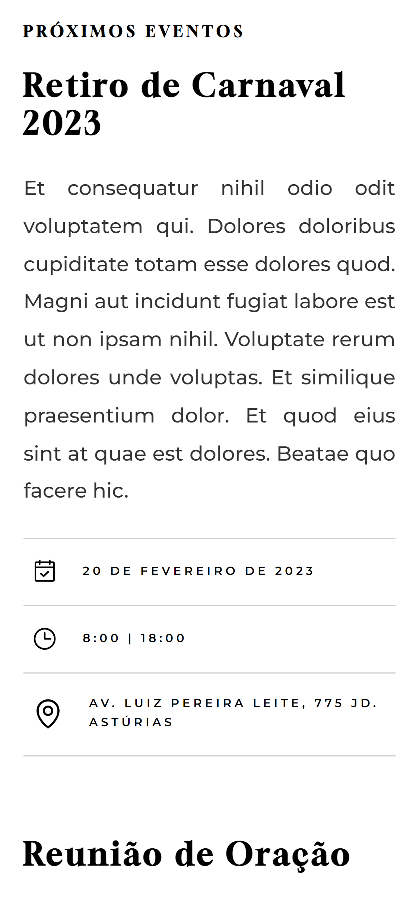

  

  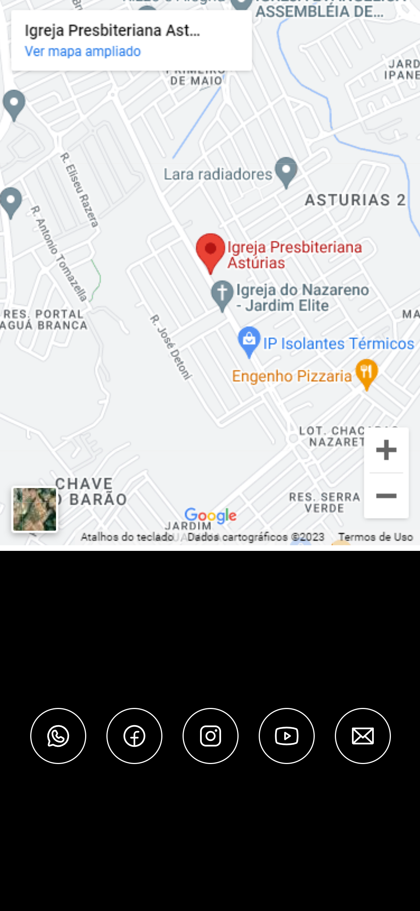

  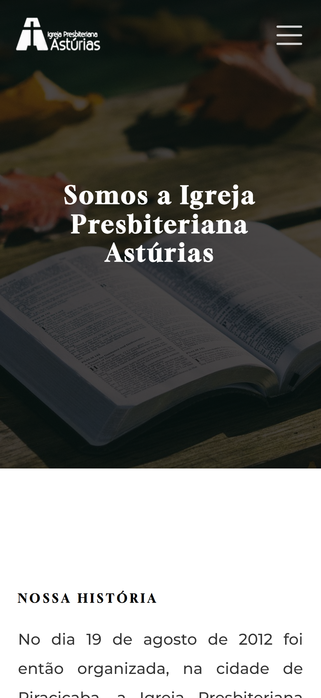

  

  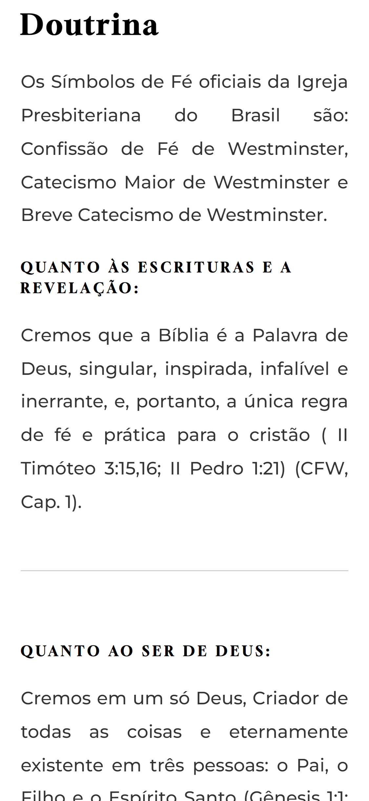

  
</p>

### 💻 Web

<p align="center">

  

  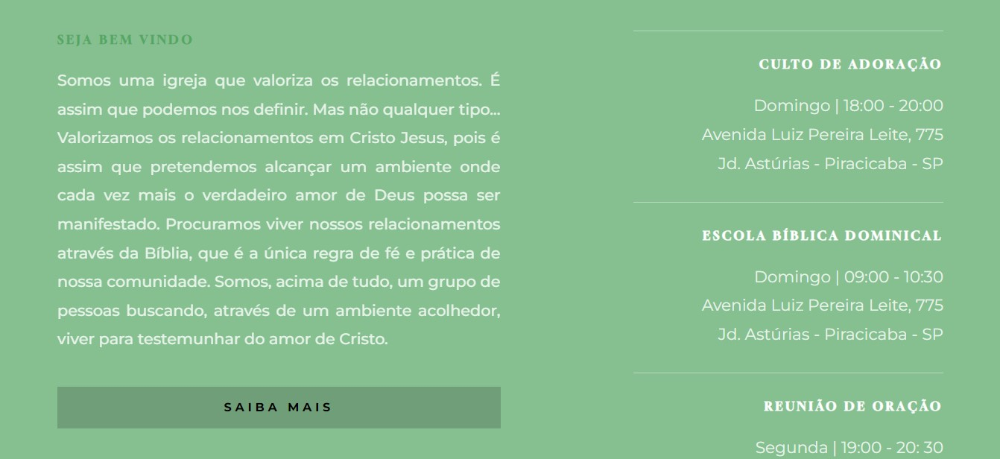

  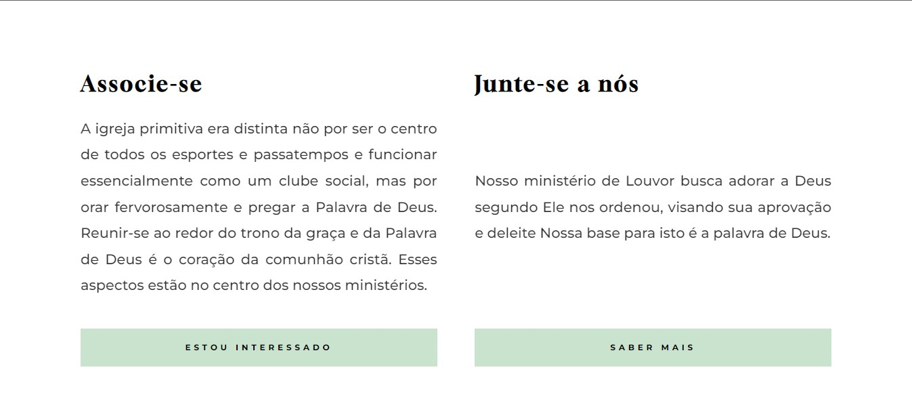

  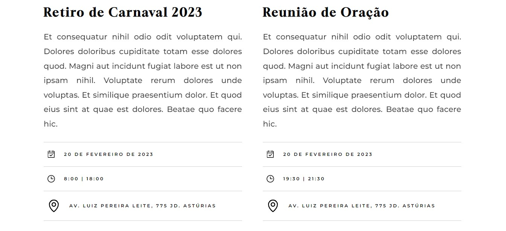

  

  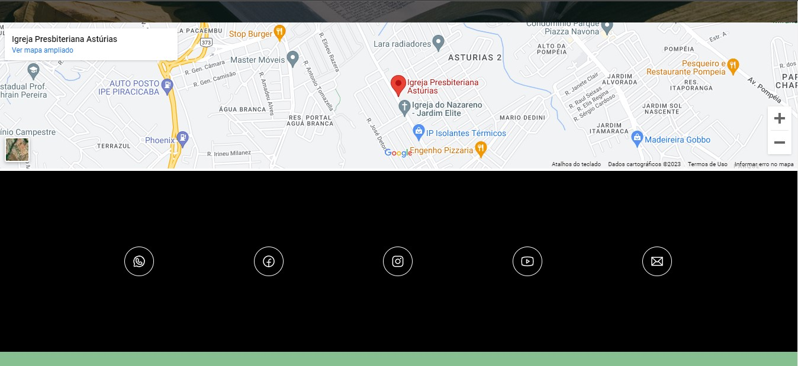

  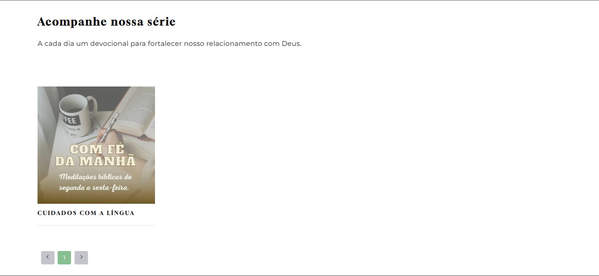

  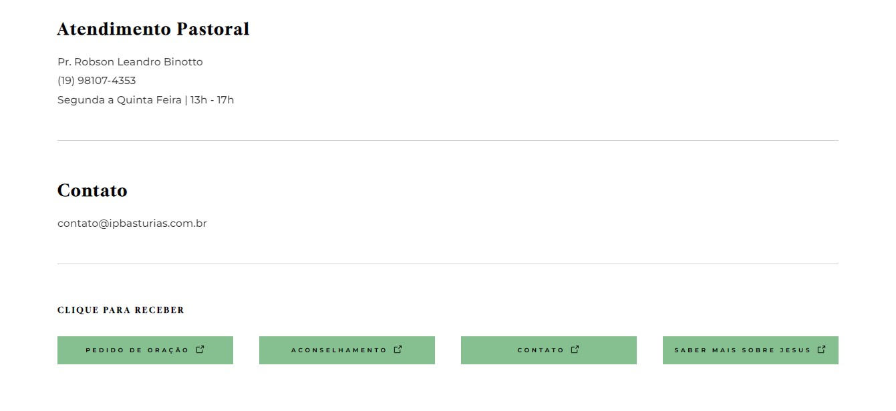

  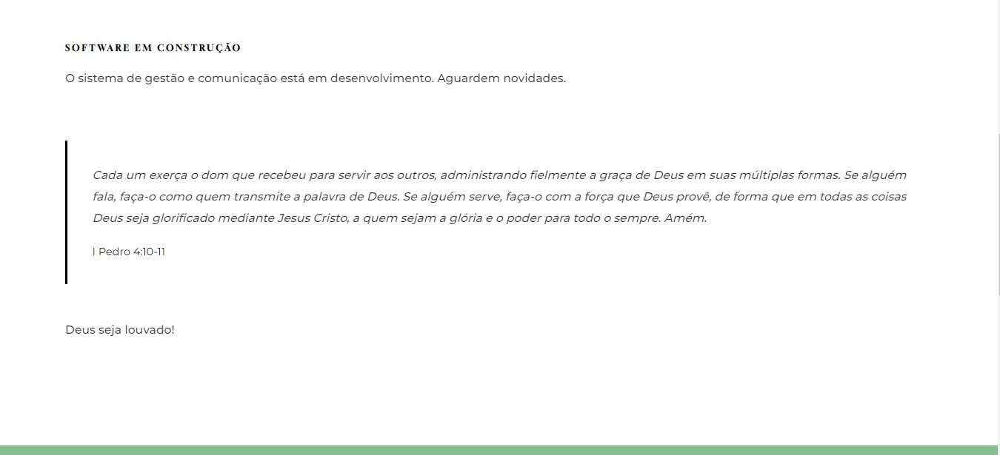
  
</p>

---

## 🚀 Como executar o projeto

Este projeto possui apenas o Frontend

Antes de começar, você vai precisar ter instalado em sua máquina as seguintes ferramentas:

- [Git](https://git-scm.com)<br />
- [Node.js](https://nodejs.org/en/)

Além disto, é bom ter um editor de código para trabalhar com o código como o [VSCode](https://code.visualstudio.com/) .

#### 🎲 Rodando o Frontend 

```bash

#Clone o repositório: 
$ git clone git@github.com:thiago-mfernandes/Asturias.git

#Acesse a pasta do projeto pelo terminal/cmd
$ cd Asturias

#Acesse a subpasta
$ cd site-asturias

#Instale as dependências do projeto
$ npm install

#Execute a aplicação em modo de desenvolvimento
$ npm run dev

# O servidor inciará na porta:3000 - acesse http://localhost:3000

```
---

## 🛠 Tecnologias

As seguintes ferramentas foram usadas na construção do projeto:

#### **Website**  

- **[NextJs](https://nextjs.org/)**

- **[Typescript](https://www.typescriptlang.org/)**

- **[Styled-Components](https://styled-components.com/)**

- **[Framer Motion](https://www.framer.com/motion/)**


#### **Utilitários**

- **[Phosphor Icons](https://phosphoricons.com/)**

- **[React-Paginate](https://github.com/AdeleD/react-paginate)**


> Veja o arquivo [package.json](https://github.com/thiago-mfernandes/Asturias/blob/main/site-asturias/package.json)

---

## 🦸 Autor


 
 <br />
 <sub>
  <b>Thiago Fernandes 🚀</b>
 </sub>
 

 
[](https://www.linkedin.com/in/thiago-mello-fernandes-frontend-react-js-javascript/)
---

## 📝 Licença

Feito com ❤️ por Thiago Fernandes 👋🏽 [Entre em contato!](https://whatsa.me/5519984009105)

---
